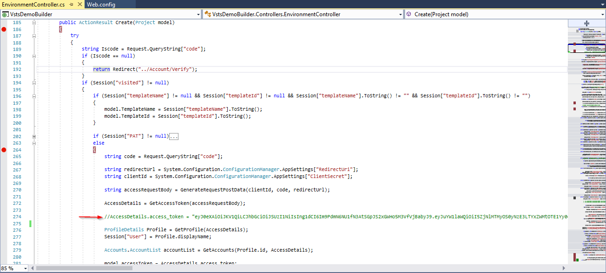
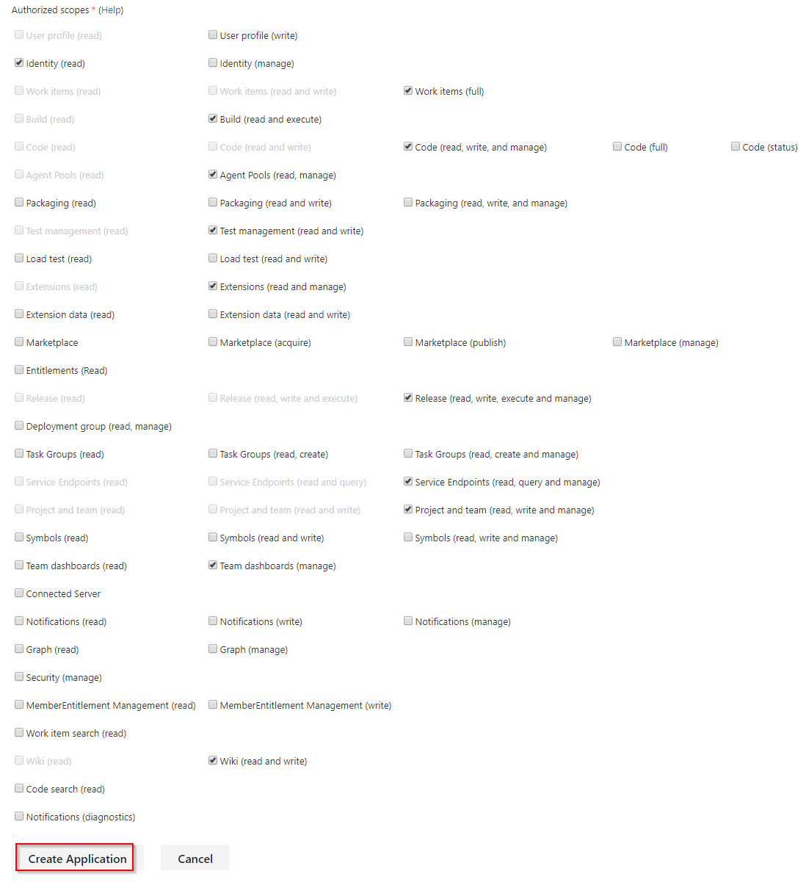
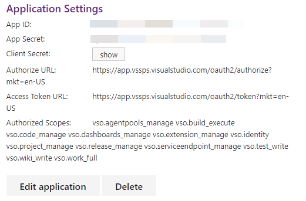

# Visual Studio Team Services Demo Generator

## About
Visual Studio Team Services Demo Generator helps you create projects on your Visual Studio Team Services account with pre-populated sample content that includes source code, work items, iterations, service endpoints, build and release definitions based on a template you choose.

The purpose of this system is to simplify working with the hands-on-labs, demos and other education material provided by the Microsoft Visual Studio Marketing team.

## Prerequisite


 1. This application requires Visual Studio 2017

 1. GitHub Account


## How to Run this application locally?

  Clone the solution to your local repository or fork it to your GitHub repo and clone it from your repository.

  To run locally you need to get access token and hard code it in the code. To get Access Token Signin with your VSTS credentials [here](https://mstokengenerator.azurewebsites.net)

  Once you got the Access Token, open **Environment Controller** in **VSTSDemoBuilder** web project, go to line number 274, uncomment it and replace the value with your access token.

   

  Keep break points at line number 186 and 264. Run your application. 

 Once the browser loads the sign in page, change the URL to ***/Environment/Create***. Once the control hits the Break point, jump the control to line number 264 and press F5 key to continue the debugging session.

## How to host?

 1. Register your application with [Microsoft App Registration](https://app.vsaex.visualstudio.com/app/register?mkt=en-US) page

 1. Fill the required details of your application

 1. In place of ***Application website*** provide the URL for your application where it is hosted.

 1. In place of ***Authorization callback URL*** provide the callback URL of your application. This is the page where your app will receive the access token from the VSTS  after a successful login

    > For this application please use ***https://YOUR_WEBSITE/Environment/Create*** as redirect URL

 1. Select the scope for your application. Based these scopes you will get Access Token from VSTS
  
    
 
    Click on ***Create Application*** button once you provide all the required details.

  1. Upon successful creation of application you will get application settings for the registered application, save these details.

      

  1. Now open Visual Studio, go to solution explorer. Under **VSTSDemoBuilder** web project open **Web.config** file. In the App Setting part of the web.config file, replace your ***App ID***, ***Client Secret*** and the ***Redirect URL***.


      ```
      <add key="ClientId" value="YOUR_APP_ID" />
      <add key="ClientSecret" value="YOUR_APPLICATION_CLIENT_SECRET" />
      <add key="RedirectUri" value="YOUR_APPLICATION_REDIRECT_URL" />
      ```
  Now you can host and run this application.


