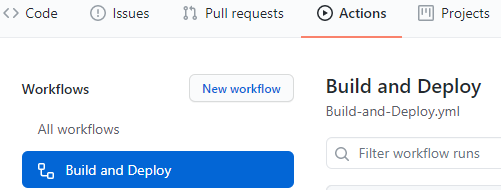
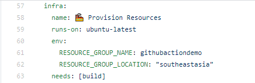
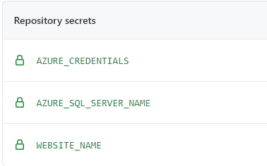
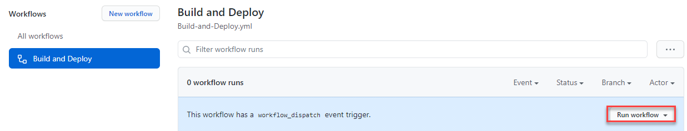

# GitHub Actions Demo

In this lab, you will learn about how to configure GitHub Action, Environment Variables and Secrets. This helps you to configure your staging and production environemnt using Azure Resource Manager Template and deploye the application.

# Prerequisites
1. GitHub account
1. Azure DevOps Organization
1. Azure Subscription to deploy resources

# Exercise

1. Create a project in your Azure DevOps Organization using [Azuer DevOps Demo Generator](http://azuredevopsdemogenerator-core.azurewebsites.net/?name=actiondemo)

2. Authenticate GitHub to import the repository into your GitHub user account.

3. Navigate to your GitHub Account, click on the Actions menu, you will see a GitHub action pre-configured

    

4. Navigate to Build and Deploy YAML file, scroll down to see the environment variables ```RESOURCE_GROUP_NAME``` and  ```RESOURCE_GROUP_LOCATION```. If you wan to change resource group name and resource group location, you can update the values here.

    

5. Navigate to Settings and to the Secrets, you should see the following secrets configured under Repository Secrets section
    
    

6. Generate Azure Credentials using RBAC commands. Please refer the document [here](https://github.com/marketplace/actions/azure-login#configure-deployment-credentials) 
7. ```AZURE_SQL_SERVER_NAME``` and ```WEBSITE_NAME``` will have preconfigured values, update the Azure Credentials in ```AZURE_CREDENTIALS``` secret

8. Run the action by clicking on Run workflow button.

    
    
